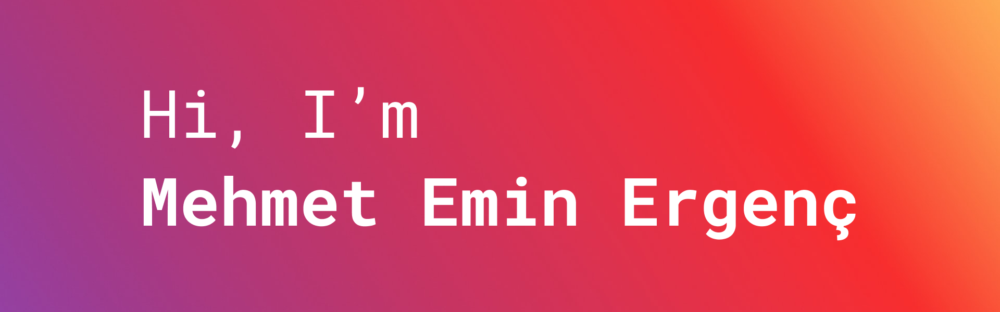

👋

I am Mehmet Emin, a highly skilled Android Developer with over three years of professional experience. I am passionate about creating efficient and innovative mobile applications using cutting edge technologies. With a strong background in Kotlin and Java, I have successfully delivered high-quality projects for major companies. My expertise includes developing scalable applications, improving user experiences, and collaborating with crossfunctional teams to achieve project goals.

Want to know more about me? [Check out all my URLs.](https://bento.me/mergenc)

